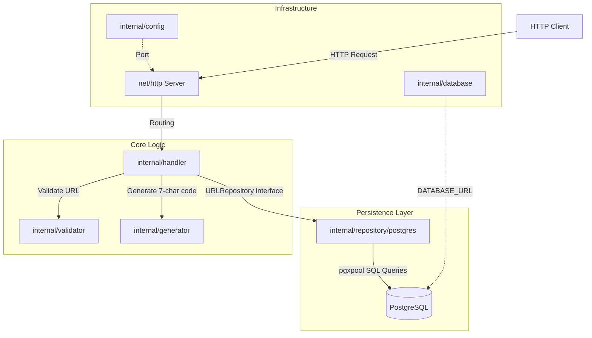
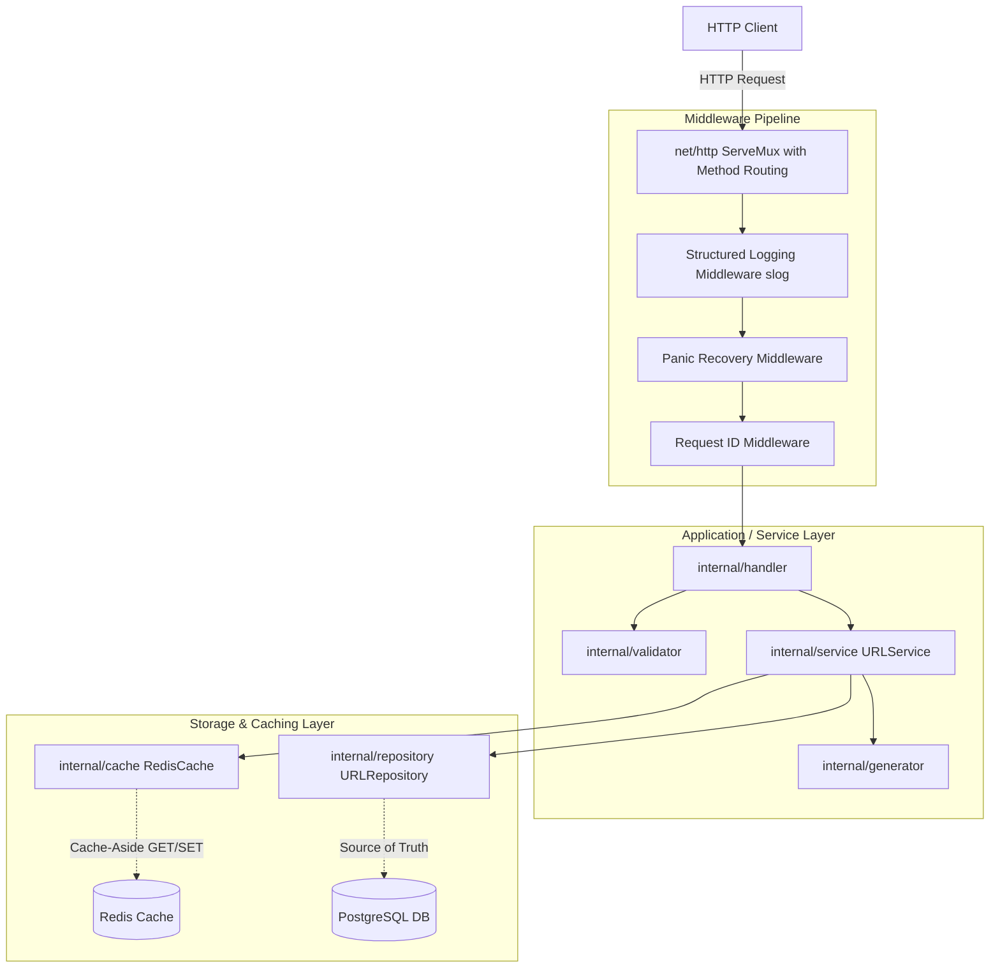
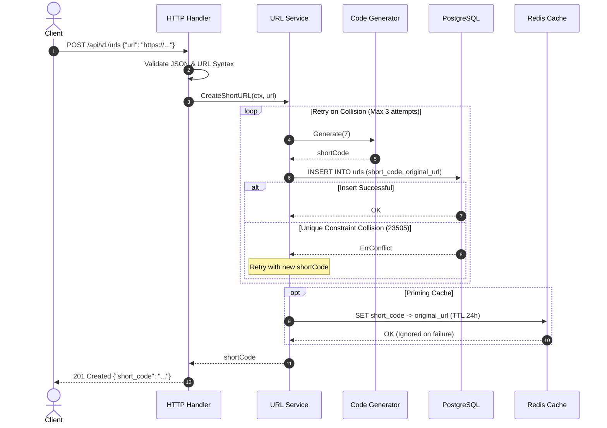
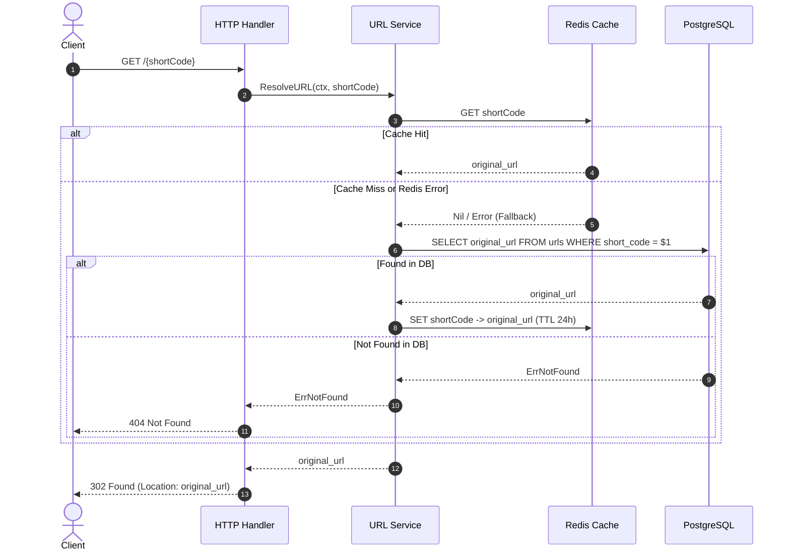

# URL Shortener V2 Design

## 1. V1 Baseline

### What V1 Provides
V1 establishes the foundational, single-node URL shortener service written in Go. Its core capabilities include:
- **HTTP Server**: Standard library `net/http` server with Go 1.22+ routing patterns.
- **URL Creation**: `POST /api/v1/urls` accepts a JSON payload `{"url": "..."}`, validates the URL, generates a random 7-character Base62 short code, and persists the mapping.
- **URL Redirection**: `GET /{shortCode}` looks up the short code directly in PostgreSQL and returns an HTTP `302 Found` redirect with the destination `Location` header.
- **URL Validation**: Application-level validation ensuring URLs are non-empty, <= 2048 characters, parseable via `net/url`, possess an `http` or `https` scheme, and specify a valid host.
- **Short-Code Generation**: Cryptographically secure random 7-character string generated from a 62-character alphanumeric alphabet (`0-9`, `A-Z`, `a-z`).
- **Persistence**: Relational storage using PostgreSQL with connection pooling via `pgxpool` (`github.com/jackc/pgx/v5`).
- **Database Migrations**: Initial migration file `migrations/001_create_urls.sql` defining the `urls` table with a unique constraint on `short_code`.
- **Health Check**: `GET /health` returning `{"status":"ok"}`.
- **Graceful Shutdown**: Intercepts `os.Interrupt` and `syscall.SIGTERM`, draining in-flight requests with a 5-second deadline context.
- **Testing**: Unit tests for the generator and validator; unit tests for handlers using an in-memory repository mock; integration tests for PostgreSQL repository operations and end-to-end HTTP request handling.

### Current Architecture
The system employs a layered architecture with explicit component isolation:
```
Client
  │
  ▼
HTTP Handler (net/http ServeMux)
  │
  ├──> Validator (internal/validator)
  ├──> Generator (internal/generator)
  │
  ▼
Repository Interface (internal/repository)
  │
  ▼
PostgreSQL Repository (internal/repository/postgres)
  │
  ▼
PostgreSQL Database (pgxpool)
```

### Current API
1. **Health Check**:
   - `GET /health`
   - Response: `200 OK`, `{"status":"ok"}`
2. **Create Short URL**:
   - `POST /api/v1/urls`
   - Headers: `Content-Type: application/json`
   - Body: `{"url": "https://example.com"}`
   - Success Response: `201 Created`, `{"short_code": "aB3xYz1"}`
   - Error Responses: `400 Bad Request` (malformed JSON, empty URL, invalid URL scheme/host, length > 2048), `500 Internal Server Error` (generation failure, database insert failure).
3. **Redirect URL**:
   - `GET /{shortCode}`
   - Success Response: `302 Found`, `Location: https://example.com`
   - Error Responses: `400 Bad Request` (missing short code), `404 Not Found` (short code not found or database error).

### Current Database Schema
Defined in `migrations/001_create_urls.sql`:
```sql
CREATE TABLE IF NOT EXISTS urls (
    id BIGSERIAL PRIMARY KEY,
    short_code VARCHAR(10) NOT NULL UNIQUE,
    original_url TEXT NOT NULL,
    created_at TIMESTAMPTZ NOT NULL DEFAULT NOW()
);
```

### Current Request Flow
- **Create URL Flow**:
  1. `HTTP POST /api/v1/urls` arrives at `handler.Handler.CreateURL`.
  2. Request body is decoded into `CreateURLRequest`.
  3. `validator.ValidateURL` checks syntax, scheme (`http`/`https`), host presence, and length.
  4. `generator.Generate(7)` creates a 7-character Base62 string using `crypto/rand`.
  5. `repo.Create(ctx, shortCode, url)` issues an `INSERT INTO urls (short_code, original_url) VALUES ($1, $2)` query.
  6. On success, returns `201 Created` with JSON payload `{"short_code": "..."}`.
- **Redirect Flow**:
  1. `HTTP GET /{shortCode}` arrives at `handler.Handler.RedirectURL`.
  2. Short code extracted via `r.PathValue("shortCode")`.
  3. `repo.GetByShortCode(ctx, shortCode)` executes `SELECT original_url FROM urls WHERE short_code = $1`.
  4. If record found, responds with `302 Found` and `Location: <originalURL>`.
  5. If query returns an error, responds with `404 Not Found`.

### Current Testing Strategy
- **Unit Tests**:
  - `internal/generator/generator_test.go`: Length validation, character alphabet validation, negative/zero length error checks, 1,000-iteration uniqueness check.
  - `internal/validator/url_test.go`: Table-driven tests verifying valid http/https URLs, empty inputs, unsupported schemes (e.g., `ftp://`), missing hosts, and syntax errors.
  - `internal/handler/url_test.go`: Isolated handler tests using `mockURLRepository` for successful creation, invalid payloads, repository errors, successful redirects, and missing keys.
- **Integration Tests**:
  - `internal/repository/postgres/postgres_test.go`: Verifies real PostgreSQL insertion, retrieval, not-found behavior, and database unique constraint violation handling (`TestCreateDuplicateShortCode`).
  - `internal/handler/integration_test.go`: End-to-end integration test creating a URL via HTTP, validating database persistence, performing redirect, and verifying cleanup.

### V1 Limitations & Technical Debt
1. **Error Classification & Masking**:
   - `postgres.Repository.GetByShortCode` returns wrapped errors without sentinel definitions.
   - `handler.RedirectURL` treats **any** error from `GetByShortCode` as `404 Not Found`. If PostgreSQL is offline, timing out, or pool-exhausted, clients receive `404 Not Found` instead of `500 Internal Server Error` or `503 Service Unavailable`.
2. **Missing Collision Handling / Retry Policy**:
   - In `handler.CreateURL`, if `generator.Generate` produces a short code that already exists in PostgreSQL, the insert fails with a unique constraint violation and returns `500 Internal Server Error` to the user. No collision detection or retry loop exists.
3. **Uncached Read Path**:
   - Every redirect executes a synchronous query against PostgreSQL. For read-heavy workloads (typical 100:1 to 1000:1 read-to-write ratio), database connections and latency become primary bottlenecks.
4. **Configuration Inconsistency**:
   - `internal/config` only reads `PORT`.
   - `internal/database` reads `DATABASE_URL` directly from `os.Getenv("DATABASE_URL")` rather than receiving it from a centralized `config.Config`.
   - Connection pool settings (`MaxConns=10`, `MinConns=2`, `MaxConnLifetime=1h`) and shutdown timeouts are hardcoded.
5. **Route Method Constraints**:
   - Routes are registered as `mux.HandleFunc("/api/v1/urls", ...)` and `mux.HandleFunc("/{shortCode}", ...)` without HTTP method specifiers (`POST`, `GET`). Non-matching methods (e.g., `GET /api/v1/urls`) trigger handler logic and return `400 Bad Request` instead of `405 Method Not Allowed`.
   - Wildcard catch-all `/{shortCode}` captures arbitrary root paths like `/favicon.ico` or `/robots.txt`.
6. **Request Protection & Limits**:
   - Request bodies in `CreateURL` are not bounded using `http.MaxBytesReader`, exposing the server to memory exhaustion from oversized payloads.
   - No rate limiting or request throttling exists.
7. **Observability Deficits**:
   - Standard library `log.Println` is used without structured fields (timestamp, request ID, latency, status code, remote IP).
   - No metrics (HTTP request counts, redirect latency, cache hit/miss ratio, database query durations, connection pool saturation).
   - `/health` does not check database connectivity (liveness vs. readiness).

---

## 2. V2 Goals

### Functional Goals
1. **Collision Retry Mechanism**: Automatically detect unique constraint collisions on URL creation and retry generation up to a configurable threshold ($N=3$) before failing.
2. **Domain Sentinel Errors**: Introduce standard domain errors (`ErrNotFound`, `ErrConflict`, `ErrInvalidInput`) in the repository and service layers so handlers return accurate HTTP status codes (`404`, `409`, `500`).
3. **Centralized Configuration**: Consolidate all environment variables (PostgreSQL config, Redis config, server timeouts, pool limits) into `internal/config`.

### Scalability Goals
1. **Read-Path Acceleration via Caching**: Introduce Redis caching for redirect lookups to offload 90%+ of read traffic from PostgreSQL.
2. **Connection Pooling Tuning**: Provide configurable connection pool parameters for both PostgreSQL and Redis to sustain higher concurrency without connection thrashing.

### Reliability Goals
1. **Cache-Aside with Resilient Fallback**: If Redis is unavailable, degraded, or times out, the system must gracefully fall back to PostgreSQL without failing client redirects.
2. **Readiness vs. Liveness Health Checks**: Enhance health checks to distinguish between process liveness (`/health/live`) and dependency readiness (`/health/ready` checking PostgreSQL and Redis).
3. **Graceful Timeout Propagation**: Enforce request-scoped context timeouts across HTTP handlers, cache calls, and database transactions.

### Performance Goals
1. **Sub-5ms Redirect Latency**: Achieve p99 redirect lookup latency under 5ms when served from Redis cache.
2. **Allocation & Buffer Optimization**: Eliminate redundant byte/string allocations during short-code generation and JSON response serialization.

### Observability Goals
1. **Structured Logging**: Adopt Go standard library `log/slog` for structured JSON logs with correlation IDs (`request_id`), duration, status code, and error context.
2. **Operational Metrics**: Instrument request rates, HTTP status codes, redirect cache hit/miss counters, database query latency, and active connection gauges.

### Learning / System-Design Goals
1. Explore cache invalidation, cache stampede mitigation, and cache-aside lifecycle patterns.
2. Demonstrate how to incrementally evolve a clean V1 monolith into a hardened, high-throughput service without premature distributed complexity.

---

## 3. Non-Goals

The following features and architectures are explicitly **out of scope** for V2:
- **No Microservices / Distributed RPC**: The application remains a modular Go monolith.
- **No Message Queues / Event Streams**: No Kafka, RabbitMQ, or Redis Streams for core URL generation or redirection.
- **No Distributed ID Generators**: No Snowflake, ZooKeeper, or Raft-based coordination clusters. Short codes remain Base62 random strings backed by database uniqueness guarantees.
- **No Custom User Authentication / Authorization**: User accounts, JWTs, and RBAC are deferred to later iterations.
- **No Advanced Analytics Engine**: Click stream tracking, GeoIP resolution, user-agent parsing, and referrer OLAP stores are deferred to V5.
- **No Multi-Region Replication**: Storage runs as a single primary PostgreSQL instance and a single Redis instance.
- **No ORM or Heavy Frameworks**: Database access continues to use `pgx/v5` and standard library `net/http`.

---

## 4. Current Architecture

### V1 Component Architecture


---

## 5. Proposed V2 Architecture

### V2 Architecture with Redis Cache-Aside


### Component Breakdown
1. **Routing & Middleware**:
   - Explicit method matching: `POST /api/v1/urls`, `GET /{shortCode}`, `GET /health/live`, `GET /health/ready`.
   - Middlewares provide context-scoped `request_id`, structured access logging via `log/slog`, and panic recovery.
2. **Service Layer (`internal/service`)**:
   - Decouples HTTP concerns (status codes, JSON serialization) from business workflows (validation, collision retry, cache coordination).
   - Coordinates the cache-aside read path and write-through/invalidation logic.
3. **Cache Layer (`internal/cache`)**:
   - Provides a clean interface for Redis operations (`Get`, `Set`, `Delete`).
   - Encapsulates error suppression so Redis outages degrade to PostgreSQL read fallbacks seamlessly.
4. **PostgreSQL Repository (`internal/repository/postgres`)**:
   - Continues as the canonical source of truth.
   - Maps database errors (like unique constraint violation `23505`) to domain sentinel errors (`repository.ErrConflict`, `repository.ErrNotFound`).

---

## 6. Design Decisions

### Decision 1: Introduce Redis Cache-Aside for Redirect Lookups
- **Decision**: Introduce Redis as a cache in front of PostgreSQL for `GET /{shortCode}` queries using the cache-aside pattern.
- **Why**: URL shortening workloads are heavily read-dominant (~100:1 to 1000:1 read-to-write ratio). Direct database lookups for high-frequency URLs consume database connections and induce disk/query overhead. Caching short-code mappings in memory reduces lookup latency from ~2-10ms to <1ms and protects PostgreSQL from read spikes.
- **Alternatives Considered**:
  - *In-memory Go cache (sync.Map / ristretto / bigcache)*: Highly efficient but node-local. If multiple service instances run behind a load balancer, memory caches remain cold across instances, risk duplicate memory usage, and complicate invalidation.
  - *Read replicas for PostgreSQL*: Adds operational overhead, replication lag, and connection overhead without achieving sub-millisecond memory-lookup speeds.
- **Trade-offs**: Introduces an external infrastructure dependency (Redis) and cache consistency considerations.
- **Future Implications**: Cache invalidation logic must be maintained if short URLs become editable or expire. Redis must be configured with appropriate memory bounds and eviction policies (e.g., `allkeys-lru`).

### Decision 2: Cache-Aside vs. Write-Through Caching
- **Decision**: Implement Cache-Aside (Lazy Loading) on reads with opportunistic write-to-cache on creation.
- **Why**: On creation (`POST /api/v1/urls`), write directly to PostgreSQL first. If successful, prime Redis immediately with the mapping. On read (`GET /{shortCode}`), check Redis first; if miss, query PostgreSQL and populate Redis with a TTL.
- **Alternatives Considered**:
  - *Pure Read-Through / Cache-Aside without pre-warming*: Causes a cache miss on the very first redirect after creation. Pre-warming on create avoids this first miss.
  - *Write-Through with Redis as buffer*: Risky; PostgreSQL must remain the transactional source of truth.
- **Trade-offs**: Slight write latency increase during `POST /api/v1/urls` (one extra Redis SET), but provides immediate 100% cache hit probability for newly shared links.

### Decision 3: Fail-Open Strategy for Redis Errors
- **Decision**: If Redis fails, times out, or returns a network error, log the failure as a warning and fall back directly to PostgreSQL.
- **Why**: The database is the system of record. A cache is a performance optimization, not an operational prerequisite for correctness.
- **Alternatives Considered**:
  - *Fail-Closed (return 500 when Redis fails)*: Unacceptable for a high-availability URL shortener; an auxiliary caching layer outage would bring down the entire redirect pipeline.
- **Trade-offs**: A sudden Redis outage causes all read traffic to hit PostgreSQL simultaneously. Connection pool limits and query timeouts protect PostgreSQL from total collapse.

### Decision 4: Retry on Collision at Application/Service Level
- **Decision**: Wrap short-code creation with an automatic retry loop (maximum 3 attempts).
- **Why**: The 7-character Base62 space has 3.52 trillion combinations. The probability of collision is low, but as the dataset grows, collisions will occur. Failing immediately on collision with HTTP 500 provides poor user experience for an easily recoverable transient event.
- **Alternatives Considered**:
  - *Pre-check with `SELECT` before `INSERT`*: Subject to race conditions between concurrent requests; requires 2 roundtrips per creation.
  - *Deterministic auto-increment IDs with Base62 encoding*: Changes the API characteristics (predictable, enumerable short URLs, sequential leak of business metrics).
- **Trade-offs**: In the unlikely event of multiple collisions, write latency increases slightly during retries.

### Decision 5: Standard Library Structured Logging (`log/slog`)
- **Decision**: Migrate from standard `log.Println` to Go's standard library `log/slog` with JSON handler.
- **Why**: Production systems require structured, queryable logs with log levels (`INFO`, `WARN`, `ERROR`), timestamps, and contextual attributes (`request_id`, `status`, `duration_ms`, `short_code`). `log/slog` is built into Go 1.21+ and requires zero third-party dependencies.
- **Alternatives Considered**:
  - *Uber zap / Zerolog*: Excellent performance, but introduces external dependencies when standard `log/slog` fulfills all current requirements.
- **Trade-offs**: None; zero dependency cost with massive observability gains.

---

## 7. Request Flows

### Create URL Flow (V2)


### Redirect Flow (V2)


---

## 8. Data Model

### PostgreSQL Tables
Table: `urls`
```sql
CREATE TABLE IF NOT EXISTS urls (
    id BIGSERIAL PRIMARY KEY,
    short_code VARCHAR(10) NOT NULL UNIQUE,
    original_url TEXT NOT NULL,
    created_at TIMESTAMPTZ NOT NULL DEFAULT NOW()
);
```

### Index Analysis
1. **`urls_pkey` (`PRIMARY KEY (id)`)**:
   - Type: B-Tree.
   - Purpose: Enforces entity identity and provides internal row ordering.
2. **`urls_short_code_key` (`UNIQUE (short_code)`)**:
   - Type: B-Tree.
   - Purpose: Guarantees global uniqueness of short codes across concurrent inserts and accelerates point lookups (`WHERE short_code = $1`) to $O(\log N)$ time complexity.
   - Justification: In a URL shortener, every redirect performs a filter on `short_code`. Without an index, this would require a sequential scan over the entire table ($O(N)$), degrading database performance as table size reaches millions of rows.

### Query Patterns
- `INSERT INTO urls (short_code, original_url) VALUES ($1, $2)`: $O(\log N)$ index maintenance.
- `SELECT original_url FROM urls WHERE short_code = $1`: Point index scan on `short_code`.
- Future consideration for V3: `CREATE INDEX idx_urls_created_at ON urls(created_at)` if background TTL expiration or date-range analytics queries are introduced.

---

## 9. Caching Strategy

### Specifications
- **Cached Entity**: Mapping of `short_code` to `original_url`.
- **Key Format**: `url:{short_code}` (e.g., `url:aB3xYz1`).
- **Value Format**: Plain string containing `original_url` (avoids JSON serialization overhead on the hot path).
- **TTL (Time to Live)**: Default 24 hours (`86400s`), with configurable jitter ($\pm 10\%$) to prevent cache expiration thundering herds.
- **Eviction Policy**: Redis instance configured with `maxmemory-policy allkeys-lru`.

### Cache Scenarios
1. **Cache Hit**: Returns cached URL immediately; latency < 1ms.
2. **Cache Miss**: Queries PostgreSQL. If found, populates Redis asynchronously or inline with TTL and redirects.
3. **Negative Caching**: If a short code is not found in PostgreSQL, cache a sentinel value (or blank string) with a short TTL (e.g., 60 seconds) to mitigate cache-penetration attacks querying nonexistent keys repeatedly.
4. **Cache Invalidation**: URLs in V2 are immutable. If URL deletion or updates are introduced in future versions, invalidation will execute via `DEL url:{short_code}`.
5. **Redis Failure / Degradation**: Circuit breaker or timeout (50ms). If Redis fails to respond within 50ms, log a warning and proceed directly to PostgreSQL.

---

## 10. Short-Code Generation

### Current Algorithm Analysis
- **Alphabet**: 62 alphanumeric characters (`0-9`, `A-Z`, `a-z`).
- **Length**: 7 characters.
- **Total Keyspace**: $62^7 = 3,521,614,606,208$ (~3.52 trillion possible codes).
- **Randomness Source**: `crypto/rand` reading from system entropy (`/dev/urandom`). Unbiased selection using `big.NewInt(62)`.
- **Collision Math**:
  By the Birthday Paradox, the collision probability after generating $k$ codes is approximately:
  $$P \approx 1 - e^{-\frac{k^2}{2 \times 62^7}}$$
  - At $k = 100,000$ codes: Collision probability is $\approx 1.4 \times 10^{-3}$ ($0.14\%$).
  - At $k = 1,000,000$ codes: Collision probability is $\approx 13\%$.
  - At $k = 10,000,000$ codes: Collision probability is $\approx 99.9\%$.
- **Conclusion**: Random generation is simple, unpredictable, and prevents sequential ID scraping. However, an automatic retry mechanism is non-negotiable as volume grows.

### Alternative ID Generation Strategies Evaluated
1. **Deterministic Auto-Increment (BIGSERIAL) + Base62**:
   - *How*: Use PostgreSQL `id` column, convert integer ID to Base62.
   - *Pros*: Zero collisions, mathematically guaranteed 100% space utilization.
   - *Cons*: Single point of bottleneck on sequence generator; sequential codes expose exact business metrics and allow trivial URL scraping unless feistel/skip32 permutation is applied.
2. **Distributed Snowflake IDs (Twitter Snowflake)**:
   - *How*: 64-bit ID composed of timestamp, machine ID, sequence number.
   - *Pros*: High generation rate across nodes, k-sorted by time.
   - *Cons*: Requires worker ID coordination; 64-bit numbers produce 11 Base62 characters instead of 7 characters; unnecessary operational complexity for V2.
3. **Verdict**: Maintain Base62 random generation with `crypto/rand` for V2, bolstered by an application-level retry loop on database collision.

---

## 11. Concurrency

### Critical Concurrency Paths
1. **Concurrent URL Creation with Identical Short Code**:
   - Two concurrent threads generate the same random code and attempt `INSERT`.
   - PostgreSQL's unique constraint `UNIQUE (short_code)` serializes the insert. One transaction succeeds; the other fails with error code `23505` (`unique_violation`).
   - The failing thread catches the error, triggers the retry loop, generates a fresh random short code, and persists successfully.
2. **Concurrent Redirects under Cache Stampede**:
   - If a popular short code expires from cache, multiple concurrent redirect requests will experience a cache miss simultaneously.
   - Mitigation for V2: Conservative query timeouts and connection pool limits in PostgreSQL; singleflight mechanism can be introduced if stampedes become noticeable during load testing.
3. **Database Connection Pool Saturation**:
   - V1 uses `MaxConns=10`. Under high concurrent load, requests will queue waiting for a free connection.
   - In V2, Redis handles 95%+ of redirect queries, dramatically reducing PostgreSQL connection pool pressure.

---

## 12. Failure Scenarios

| Failure Scenario | Expected Behavior | HTTP Behavior | Logging Level | Retry Behavior | Fatal? |
| :--- | :--- | :--- | :--- | :--- | :--- |
| **PostgreSQL Down** | Redirects served from Redis if cached; URL creation fails immediately; uncached redirects fail. | `503 Service Unavailable` on uncached paths | `ERROR` with connection details | Exponential backoff reconnect in background | No for cached reads; Yes for writes |
| **Redis Down** | All reads gracefully fall back to PostgreSQL. Creation skips cache pre-warming. | `200 OK` / `302 Found` (graceful degradation) | `WARN` with failure reason | Async reconnection attempts | No |
| **Database Query Timeout** | Context canceled after deadline (e.g., 2s); query aborted by `pgx`. | `504 Gateway Timeout` or `500 Internal Server Error` | `ERROR` | None at HTTP layer | No |
| **Redis Cache Timeout** | Context canceled after cache deadline (50ms); bypass cache, query DB. | `302 Found` via PostgreSQL fallback | `WARN` | None | No |
| **Short-Code Collision** | Intercept database unique violation (`23505`); generate new code. | Transparent to client; returns `201 Created` | `INFO` / `DEBUG` on retry | Retry up to 3 times | No |
| **Context Cancellation (Client Disconnect)** | Handler detects `r.Context().Done()`; cancels DB query and terminates. | No response sent (client closed) | `DEBUG` | None | No |
| **Connection Pool Exhaustion** | Requests wait up to pool acquisition timeout; fail cleanly if exceeded. | `503 Service Unavailable` | `ERROR` | Caller client retry | No |
| **Application Restart / SIGTERM** | Drain active connections up to shutdown context timeout (10s); close pools cleanly. | Complete in-flight requests; reject new requests | `INFO` | N/A | No |

---

## 13. Observability

### Logging Architecture
- Transition from unstructured `log.Printf` to `log/slog`.
- Format: JSON in production, text/color in local development.
- Attributes logged on every HTTP request:
  - `timestamp`: ISO 8601 UTC.
  - `request_id`: Generated UUID or incoming `X-Request-ID`.
  - `method`: `POST`, `GET`, etc.
  - `path`: URL path.
  - `status`: HTTP response status code.
  - `duration_ms`: Duration of request processing in milliseconds.
  - `remote_ip`: Client IP address.
  - `error`: Error message and stack trace if status >= 500.

### Metrics Strategy
- Prometheus-compatible metrics endpoint `GET /metrics`:
  - `http_requests_total{method, path, status}`: Counter of total HTTP requests.
  - `http_request_duration_seconds{method, path}`: Histogram of request latencies.
  - `cache_hits_total{cache="redis"}`: Counter of cache hits.
  - `cache_misses_total{cache="redis"}`: Counter of cache misses.
  - `db_query_duration_seconds{query}`: Histogram of PostgreSQL query durations.
  - `db_pool_connections{state="active|idle|total"}`: Connection pool gauges.

### Health Endpoints
- `GET /health/live`: Process liveness check. Always returns 200 if the HTTP server is running.
- `GET /health/ready`: Readiness check. Verifies active connectivity to PostgreSQL (via `Ping`) and Redis (via `Ping`). Returns 200 if ready, 503 if primary dependencies are degraded.

---

## 14. Testing Strategy

### Test Pyramid for V2
1. **Unit Tests**:
   - Fast, isolated, zero-network tests running in milliseconds.
   - Coverage: URL validator, code generator, config loader, middleware handlers, mock repository/service interactions.
2. **Repository & Integration Tests**:
   - Validates concrete PostgreSQL queries and constraint behavior using isolated test databases.
   - Validates Redis cache operations, cache miss handling, and TTL expiration.
3. **Resilience & Failure-Path Tests**:
   - Simulate Redis failure: Verify that redirect continues to function seamlessly via PostgreSQL fallback.
   - Simulate database unique constraint collision: Verify retry loop generates a replacement code without error.
4. **Concurrency & Race Condition Tests**:
   - `go test -race ./...` must pass across all packages.
   - Parallel test runs spawning 50+ concurrent requests creating and redirecting short codes.
5. **Benchmarks**:
   - Benchmark code generator allocation rate (`BenchmarkGenerate`).
   - Benchmark cache lookup vs database lookup.

---

## 15. Performance

### Performance Targets
- **Redirect Latency (Cache Hit)**: p50 < 1ms, p99 < 5ms.
- **Redirect Latency (Cache Miss / Fallback)**: p50 < 8ms, p99 < 25ms.
- **Creation Latency**: p50 < 15ms, p99 < 50ms.
- **Throughput**: Support 5,000+ redirect requests/sec per server instance on standard commodity hardware.

### Measurement Methodology
- Use Go standard benchmarks (`go test -bench=. -benchmem`) for CPU/memory profiling.
- Use synthetic load testing tools (`k6` or `wrk`) against local and staging deployments to quantify latency distributions under variable concurrency.

---

## 16. Security

### Current Security Posture & Risks
1. **Open Redirect Vulnerability**:
   - *Risk*: A shortener can be used as an open redirector by malicious actors to obscure phishing destinations.
   - *Mitigation*: Restrict supported schemes to `http` and `https`; reject private/loopback IP targets (SSRF protection) where necessary.
2. **SSRF (Server-Side Request Forgery)**:
   - The shortener currently redirects clients rather than fetching URLs internally, which avoids internal network SSRF. However, if link unfurling or page preview scraping is added later, strict CIDR egress filtering will be required.
3. **Denial of Service (DoS) via Payload Inflation**:
   - *Vulnerability in V1*: `json.NewDecoder(r.Body).Decode(&req)` reads unbounded payload streams into memory.
   - *Fix in V2*: Wrap request bodies with `http.MaxBytesReader(w, r.Body, 10240)` to strictly reject payloads over 10KB.
4. **Short-Code Enumeration / Scraping**:
   - 7-character Base62 space ($3.5 \times 10^{12}$) resists trivial enumeration compared to sequential integer IDs. Rate limiting prevents high-velocity scraping.
5. **Secrets & Environment Hygiene**:
   - Database credentials and Redis auth strings are injected strictly through environment variables; zero hardcoded secrets.

---

## 17. Migration Strategy

### Principles
- Every database schema change must be documented as an incremental, numbered SQL migration in `migrations/`.
- Existing applied migrations (e.g., `001_create_urls.sql`) are **immutable** and must never be altered retroactively.
- Schema changes must be backward-compatible (expand before contract).

### V2 Schema Evolutions
- Any new fields (such as `expires_at`, `click_count`, or secondary indexes) will be introduced in `migrations/002_*.sql`.
- In V2, the current table structure is sufficient for the core cache-aside workflow.

---

## 18. Backward Compatibility

### Guarantees
- **API Endpoints**:
  - `POST /api/v1/urls` contract remains 100% identical. Request: `{"url": "..."}`, Response: `{"short_code": "..."}` with `201 Created`.
  - `GET /{shortCode}` redirect behavior remains identical: `302 Found` with `Location` header.
  - `GET /health` continues to return `200 OK` `{"status":"ok"}`.
- **Database Compatibility**: Existing records in `urls` remain valid and operable without data migrations.

---

## 19. V2 Roadmap

The V2 evolution is broken down into structured, incremental milestones:

### Phase 1: Architectural Hardening & Service Layer
- [x] Centralize configuration in `internal/config` (unify `DATABASE_URL`, `PORT`, pool limits, timeouts).
- [x] Implement domain sentinel errors (`ErrNotFound`, `ErrConflict`, `ErrInvalidInput`).
- [x] Introduce clean Service layer (`internal/service`) separating HTTP transport from business logic.
- [x] Implement short-code collision detection and automatic retry loop (up to 3 attempts).
- [x] Enforce bounded request body size (`http.MaxBytesReader`) and strict HTTP method routing in `net/http`.
- [x] Fix redirect error masking bug (distinguish `ErrNotFound` [404] from database/internal errors [500]).

### Phase 2: Observability & Middleware
- [x] Implement structured logging using `log/slog`.
- [x] Add Request ID middleware generating/propagating `X-Request-ID`.
- [x] Add Panic Recovery middleware.
- [x] Expand health checks into liveness (`/health/live`) and readiness (`/health/ready` checking PostgreSQL).

### Phase 3: High-Performance Caching Layer (Redis)
- [x] Define cache abstraction interface (`internal/cache`).
- [x] Implement Redis cache client using `github.com/redis/go-redis/v9`.
- [x] Implement Cache-Aside on redirect lookups (`GET /{shortCode}`).
- [x] Implement cache pre-warming on URL creation (`POST /api/v1/urls`).
- [x] Implement fail-open resilience (PostgreSQL fallback when Redis is unreachable).
- [x] Update readiness check to include Redis ping.

### Phase 4: Rate Limiting & Protection
- [x] Implement client IP rate limiting middleware (token bucket / sliding window in Redis or memory) on `POST /api/v1/urls`.
- [x] Add SSRF checks (block loopback, RFC1918 private IPs, AWS metadata endpoints `169.254.169.254`).

### Phase 5: Verification, Benchmarking & Load Testing
- [x] Comprehensive unit, repository, and cache integration test suite.
- [x] Chaos/failure-path integration tests verifying Redis outage fallback.
- [x] Benchmarks comparing cached vs uncached redirect latency.

---

## 20. Completed Work
- [x] Initial repository archaeology and architecture audit.
- [x] Identification of V1 technical debt and edge-case behaviors.
- [x] Creation of V2 Design Specification and Engineering Journal (`docs/V2_DESIGN.md`).
- [x] **Phase 1 Complete**: Centralized config, domain sentinel errors, dedicated service layer with collision retry loop, bounded request bodies, method routing, and redirect error-masking fix.
- [x] **Phase 2 Complete**: Structured JSON/Text logging with `log/slog`, request ID generation and propagation middleware (`X-Request-ID`), panic recovery middleware with stack traces, and decoupled liveness (`/health/live`) & readiness (`/health/ready`) health checks.
- [x] **Phase 3 Complete**: High-performance Cache-Aside Redis layer with `go-redis/v9`, opportunistic pre-warming on creation, fail-open database fallback on cache degradation, and multi-dependency readiness health probing.
- [x] **Phase 4 Complete**: Per-client IP token-bucket rate limiting middleware with automatic token replenishment and idle bucket cleanup on `POST /api/v1/urls`, along with SSRF validation blocking IPv4/IPv6 loopback, private RFC1918, link-local (AWS metadata `169.254.169.254`), and internal hostname aliases.
- [x] **Phase 5 Complete**: Comprehensive unit/integration test suite, chaos failure-injection testing (outages, stampedes, collision bursts with race detector verification), and CPU/memory allocation benchmarks.

---

## 21. Open Questions
1. **Redis vs Keyv/In-Memory fallback**: Should the service support running without Redis entirely in local development modes (e.g., using an in-memory TTL map), or should Redis be a hard dependency for production deployments?
2. **Singleflight for Cache Misses**: Should we introduce `golang.org/x/sync/singleflight` in V2 to prevent multiple concurrent requests for the same cold short code from stampeding PostgreSQL?
3. **Short-Code Alphabet Adjustments**: Are there any ambiguous characters in Base62 (like `0` vs `O`, `1` vs `l` vs `I`) that would justify a Base58/Base56 alphabet, or does backward compatibility dictate keeping standard Base62?

---

## 22. Future V3 Ideas
- **Database Read Replicas**: Route `SELECT` queries to read replicas and `INSERT` queries to the primary PostgreSQL instance.
- **Asynchronous Click Analytics**: Emit redirect events to a background worker for click count, referrer, and user-agent logging without impacting redirect latency.
- **Custom Vanity Codes & TTL Expiration**: Support user-defined aliases (e.g., `/my-link`) and optional expiration timestamps (`expires_at`).
- **Distributed ID Generation**: Evaluate Base62-encoded 64-bit integer sequences if collision rates become prohibitive at multi-billion URL scales.
